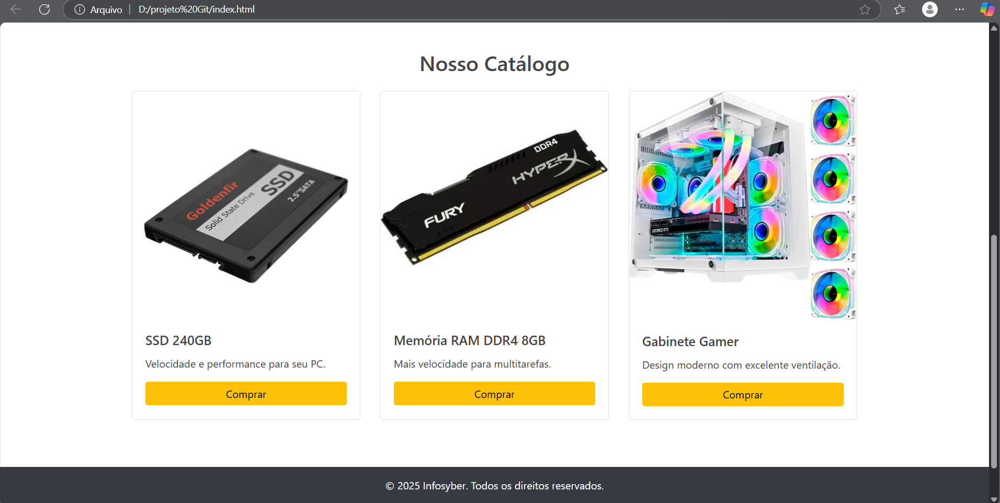

# Infosyber 🖥️

Site fictício para vendas de acessórios de informática, como SSDs, memórias RAM, gabinetes e muito mais.

Este projeto foi desenvolvido como exercício de programação utilizando HTML, CSS, Bootstrap e jQuery.

---

## 📌 Sobre o projeto

A **Infosyber** é uma empresa especializada em acessórios de informática. Este site simula uma loja virtual com catálogo de produtos, botão de pesquisa e design responsivo.

---

## 🚀 Tecnologias utilizadas

- **HTML5** – Estrutura da página
- **CSS3** – Estilização externa personalizada
- **Bootstrap 4** – Layout responsivo e componentes visuais
- **jQuery** – Funcionalidades e interatividade com JavaScript simplificado

---

## 🖼️ Estrutura de pastas
infosyber/
├── index.html
├── style.css
├── script.js
├── logo.png
├── ssd.jpg
├── memoria.jpg
└── gabinete.jpg

---

## ⚙️ Como usar

1. Clone o repositório:

```bash
git clone https://github.com/seu-usuario/infosyber.git



✏️ Autor
Projeto feito por [Wellington pereria de lima iris]
💻 Técnico em Informática | Estudante de programação front-end
📧 Contato: [wellestudos510@gmail.com]

---

Se quiser, posso adaptar esse README com o link exato do seu GitHub quando você fizer o push. Deseja que eu gere também o `.gitignore` e o comando de inicialização do repositório?
